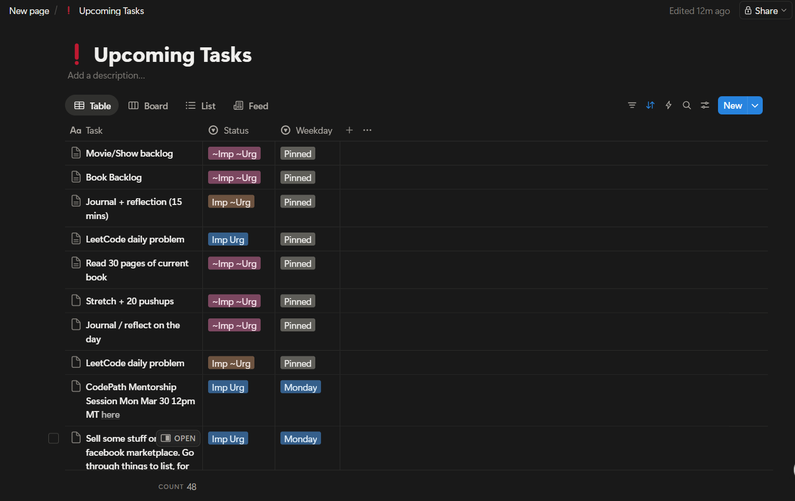
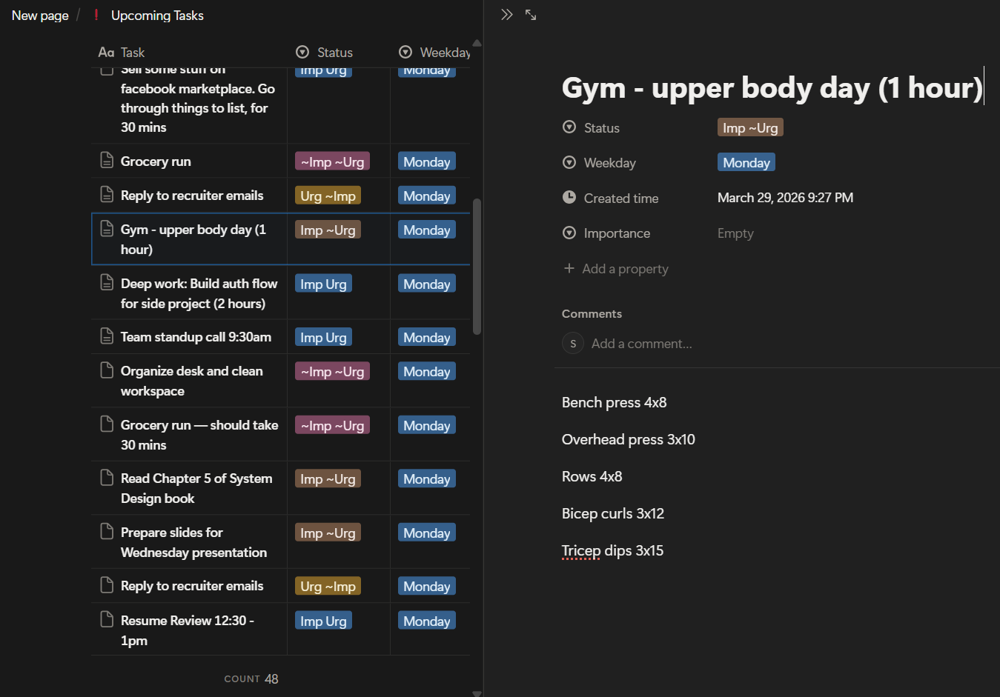
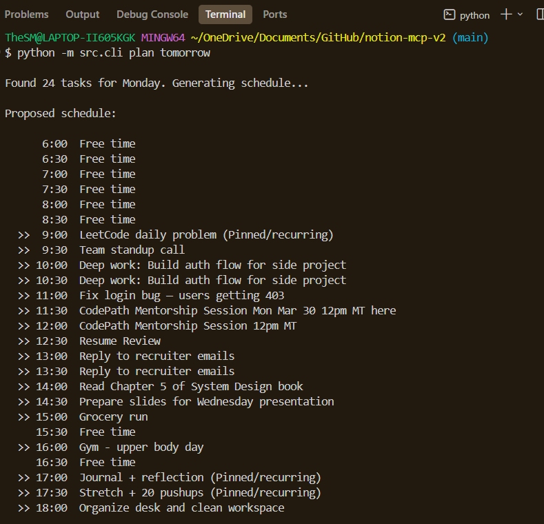
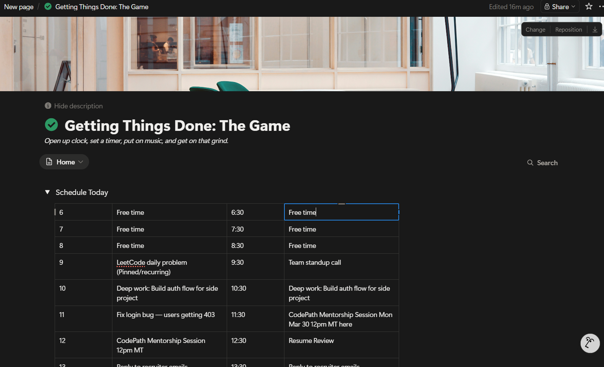
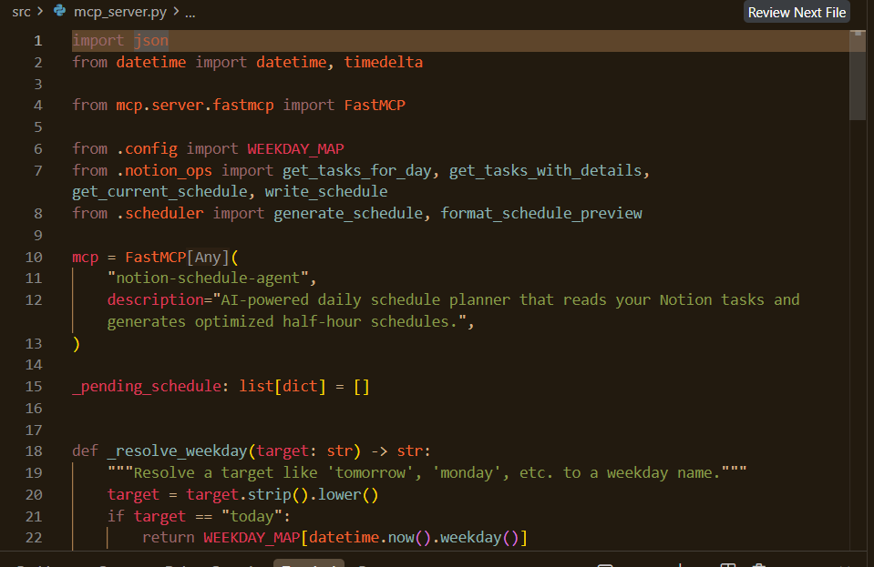

# Notion Schedule Agent

An MCP server that turns your Notion task list into an AI-optimized daily schedule.

Every night you pull tomorrow's tasks from your "Upcoming Tasks" database and manually slot them into half-hour blocks. This agent does that for you — it reads your tasks (including page body content like workout plans and watchlists), understands priorities via the Eisenhower matrix, respects fixed-time commitments parsed from task names, and writes a clean schedule back to Notion.

## Demo

### 1. Tasks in Notion with Eisenhower priorities and weekday assignments



### 2. The agent reads full page content for smarter scheduling



### 3. One command generates an AI-optimized daily schedule



### 4. Schedule written back to Notion as a half-hour block table



### 5. Built as an MCP server — usable from Claude Desktop, Cursor, or any MCP client



## How It Works

```
┌──────────────────┐       ┌──────────────────┐       ┌──────────────────┐
│  Upcoming Tasks  │──────▶│   AI Scheduler   │──────▶│  Schedule Today  │
│  (Notion DB)     │       │   (OpenAI)       │       │  (Notion Table)  │
│                  │       │                  │       │                  │
│  • Task name     │       │  • Reads page    │       │  6:00  Free time │
│  • Priority      │       │    body content  │       │  9:00  LeetCode  │
│  • Weekday       │       │  • Parses times  │       │  9:30  Standup   │
│  • Page content  │       │  • Sorts by      │       │ 10:00  Deep work │
│                  │       │    priority      │       │  ...             │
└──────────────────┘       └──────────────────┘       └──────────────────┘
```

### Priority System (Eisenhower Matrix)

| Status | Meaning | Scheduling |
|--------|---------|------------|
| `Imp Urg` | Important & Urgent | Peak focus hours first |
| `Urg ~Imp` | Urgent, not important | Soon, lighter slots |
| `Imp ~Urg` | Important, not urgent | Focused time available |
| `In Progress` | Currently being worked on | Dedicated blocks |
| `~Imp ~Urg` | Neither important nor urgent | Fill remaining gaps |
| `Pinned` | Recurring/daily tasks | Spread across the day |

### Key Features

- **Deep content reading** — reads the body of each task page (bullet lists, paragraphs) so the AI understands what "Gym - upper body" actually involves
- **Time-locked tasks** — parses times from task names (e.g. "Team standup 9:30am") and locks them to the correct slot
- **Eisenhower priority** — schedules Important & Urgent tasks in peak focus hours, lighter tasks in the evening
- **Two-step workflow** — preview the schedule before writing it to Notion
- **MCP server** — any MCP client can invoke `plan_day`, `get_tasks`, and `apply_schedule`

## Setup

### 1. Install dependencies

```bash
pip install -r requirements.txt
```

### 2. Create a Notion Integration

1. Go to [notion.so/my-integrations](https://www.notion.so/my-integrations)
2. Click **New integration**, give it a name (e.g. "Schedule Agent")
3. Copy the **Internal Integration Secret** — this is your `NOTION_API_KEY`

### 3. Share your Notion pages with the integration

1. Open your **Upcoming Tasks** database in Notion
2. Click **...** → **Connections** → select your integration
3. Do the same for your **Getting Things Done** page (the one with "Schedule Today")

### 4. Get your database and page IDs

- Open **Upcoming Tasks** in Notion. The URL looks like:
  `https://notion.so/workspace/YOUR_DB_ID?v=...`
  Copy the 32-character hex ID.

- Open **Getting Things Done** page. Same format — copy the page ID.

### 5. Configure environment

```bash
cp .env.example .env
```

Edit `.env` with your keys:

```
NOTION_API_KEY=ntn_your_key_here
OPENAI_API_KEY=sk-your_key_here
NOTION_TASKS_DB_ID=your_database_id
NOTION_SCHEDULE_PAGE_ID=your_page_id
```

## Usage

### CLI Mode

```bash
# List tomorrow's tasks
python -m src.cli tasks tomorrow

# Generate and apply a schedule for tomorrow
python -m src.cli plan tomorrow

# Plan a specific day
python -m src.cli plan monday
```

The `plan` command shows a preview and asks for confirmation before writing to Notion.

### MCP Server Mode

Run the server for use with Claude Desktop, Cursor, or any MCP client:

```bash
python -m src.mcp_server
```

#### Claude Desktop configuration

Add to your `claude_desktop_config.json`:

```json
{
  "mcpServers": {
    "notion-schedule-agent": {
      "command": "python",
      "args": ["-m", "src.mcp_server"],
      "cwd": "/path/to/notion-mcp-v2",
      "env": {
        "NOTION_API_KEY": "ntn_...",
        "OPENAI_API_KEY": "sk-...",
        "NOTION_TASKS_DB_ID": "...",
        "NOTION_SCHEDULE_PAGE_ID": "..."
      }
    }
  }
}
```

#### Available MCP Tools

| Tool | Description |
|------|-------------|
| `get_tasks(day)` | List tasks for a given day from Notion |
| `plan_day(day)` | Generate an AI-optimized schedule (preview) |
| `apply_schedule()` | Write the previewed schedule to Notion |

`day` accepts `"today"`, `"tomorrow"`, or a weekday name like `"Monday"`.

## Tech Stack

- **Python** — core language
- **Notion API** via `notion-client` — reads task database + page content, writes schedule table
- **OpenAI** (`gpt-4o-mini`) — intelligent scheduling with priority awareness
- **MCP** (Model Context Protocol) via `mcp` SDK — exposes tools to any MCP client

## Project Structure

```
src/
  config.py        — environment config, time slots, priority mapping
  notion_ops.py    — Notion API operations (read tasks + page content, write schedule)
  scheduler.py     — OpenAI-powered schedule generation
  mcp_server.py    — MCP server entry point with tool definitions
  cli.py           — standalone CLI for direct usage
```

## License

MIT
